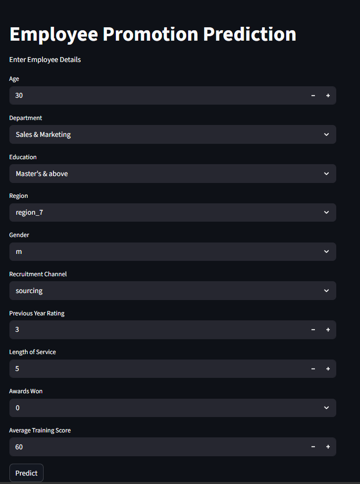
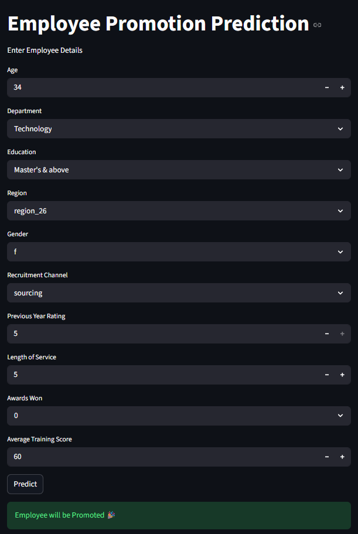

# Employee Promotion Prediction using Machine Learning

## 📌 Project Overview

This project predicts whether an employee is likely to be promoted based on various professional and personal attributes. It applies multiple Machine Learning algorithms, compares their performance, performs hyperparameter tuning, and deploys the final model using **Streamlit**.

The goal is to help HR departments make data-driven promotion decisions by analyzing employee-related factors.

---

## 🚀 Features

- Data Cleaning and Preprocessing
- Exploratory Data Analysis (EDA)
- Handling Missing Values
- Label Encoding & Ordinal Encoding
- Feature Scaling using StandardScaler
- Handling Class Imbalance using SMOTE
- Training Multiple Machine Learning Models
- Hyperparameter Tuning
- Model Evaluation and Comparison
- Streamlit Web Application for Predictions

---

## 📂 Dataset

The project uses the **Employee Promotion Prediction** dataset.

### Input Features

- Department
- Region
- Education
- Gender
- Recruitment Channel
- Number of Trainings
- Age
- Previous Year Rating
- Length of Service
- Awards Won
- Average Training Score

### Target Variable

- **is_promoted**
  - 0 → Not Promoted
  - 1 → Promoted

---

## 📊 Exploratory Data Analysis

The following analyses were performed:

- Dataset Information
- Missing Value Analysis
- Duplicate Check
- Statistical Summary
- Correlation Heatmap
- Count Plots
- Distribution Plots
- Box Plots
- Feature Relationship Analysis

---

## ⚙️ Data Preprocessing

The preprocessing pipeline includes:

- Handling missing values
- Label Encoding
- Ordinal Encoding
- Feature Scaling using StandardScaler
- Train-Test Split
- SMOTE for balancing the target classes

---

## 🤖 Machine Learning Models

The following models were trained and evaluated:

- Logistic Regression
- K-Nearest Neighbors (KNN)
- Support Vector Machine (SVM)
- Naive Bayes
- Decision Tree
- Random Forest
- AdaBoost
- Gradient Boosting
- XGBoost

Each model was evaluated before and after hyperparameter tuning.

---

## 📈 Model Evaluation

The models were evaluated using:

- Accuracy Score
- Precision
- Recall
- F1 Score
- Confusion Matrix
- Classification Report

The best-performing model was selected for deployment.

---

## 🖥️ Streamlit Application

The trained model is deployed using **Streamlit**.

The application allows users to:

- Enter employee details
- Predict promotion status instantly
- View prediction results through a simple interface

---

## 🛠️ Technologies Used

- Python
- Pandas
- NumPy
- Matplotlib
- Seaborn
- Scikit-learn
- XGBoost
- Imbalanced-learn (SMOTE)
- Joblib
- Streamlit

---

## 📁 Project Structure

```
Employee-Promotion-Prediction/
│
├── dataset/
│   └── employee_promotion.csv
│
├── models/
│   ├── employee_model.pkl
│   ├── scaler.pkl
│   ├── oe.pkl
│   ├── l1.pkl
│   ├── l2.pkl
│   ├── l3.pkl
│   └── l4.pkl
│
├── app.py
├── pj1.ipynb
├── requirements.txt
├── README.md
└── images/
```

---

## ▶️ Installation

Clone the repository

```bash
git clone https://github.com/yourusername/Employee-Promotion-Prediction.git
```

Move into the project directory

```bash
cd Employee-Promotion-Prediction
```

Install the dependencies

```bash
pip install -r requirements.txt
```

Run the Streamlit application

```bash
streamlit run app.py
```

---

## 📸 Application Preview

### 🏠 Home Screen


### 🎉 Promoted Result


### ❌ Not Promoted Result


---

## 🎯 Future Improvements

- Deploy on Streamlit Cloud
- Add feature importance visualization
- Probability prediction
- Batch prediction using CSV upload
- Explain predictions using SHAP

---

## 👩‍💻 Author

**Shamila Shirin M K**

- MCA Student (IGNOU)
- Data Science Learner
- Passionate about Machine Learning and Artificial Intelligence

---

## ⭐ If you found this project useful, consider giving it a Star!
